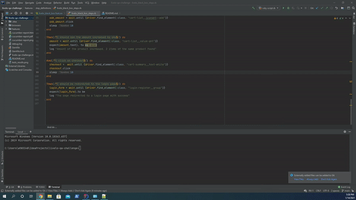
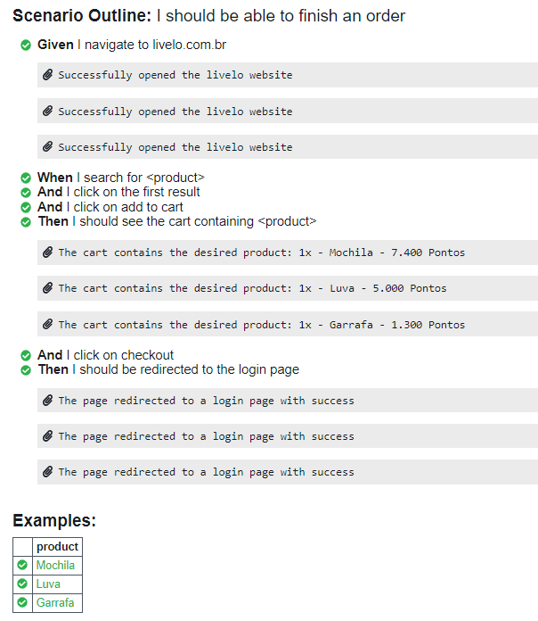
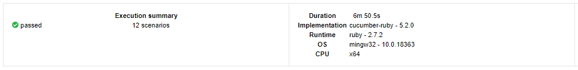

# 👨‍💻 QA Ruby, Cucumber and Selenium Automation - Livelo Website

<p align="center">
  
  
  
  
</p>

Ruby, Cucumber and Selenium front-end test automation in the add to cart functionality of a website (`https://www.livelo.com.br/`). 

The features of the tests are inside `features/livelo_black_box.feature` and the step definitions are inside `features/step_definitions/livelo_black_box_steps.rb`

## 🎥 Tests Execution Demonstration

<p align="center">
  
</p>

## 📅 Cucumber Report
  
- [Link to Cucumber Report HTML](cucumber-report.html)
- [Link to Cucumber Report PDF](cucumber-report.pdf)

## 💾 Development Dependencies Used

- "Ruby":  "2.7.2"
- "Bundler": "2.2.5"
- "Cucumber": "5.2.0"
- "RSpec": "3.4.0"
- "Selenium Web Driver": "3.142.7"
- "Chrome Driver": "87.0.4280.88"
- "Google Chrome": "87.0.4280.141"

## 🎬 Getting Started

1. Clone the project into your machine and install all dependencies described above using:

```console
bundle install
```

2. Now, to run the tests:

```console
cucumber
```

3. Verify the tests results output:



<h2><a class="anchor" aria-hidden="true" href="#memo-license">:pencil:</a> License </h2>
<p>This project is under the MIT license. See the <a href="https://github.com/beck-developer/livelo-qa-challenge/blob/master/LICENSE">LICENSE</a> for more information.</p>
---

Made with ❤ by Matheus Beck 👋 [Get in touch!](https://www.linkedin.com/in/matheus-beck/)
